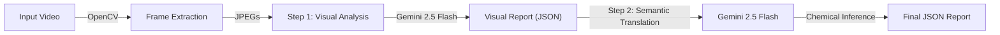

# 👃 VLM2SMELL: Olfactory Video Analysis System

> **From Pixels to Molecules:** A Video-to-Scent Translation Pipeline powered by Multimodal LLMs.


## 📖 Overview

**VLM2SMELL** is a pioneering research framework designed to bridge the gap between **Visual Perception** and **Olfactory Inference**. By leveraging the advanced sequence understanding capabilities of modern Visual Language Models (specifically **Gemini 2.5 Flash**), this system transforms raw video footage into structured chemical and sensory olfactory profiles.

Unlike traditional frame-by-frame analysis, VLM2SMELL treats video as a **continuous temporal sequence**, allowing it to:
1.  **Extract Visual Ground Truth**: Identify objects, states, and thermal cues over time.
2.  **Infer Olfactory Events**: Detect activities that release scent (e.g., *slicing lemon*, *frying steak*, *rain on asphalt*).
3.  **Map to Chemistry**: Translate semantic descriptions into specific odorant molecules (e.g., *Limonene*, *Maillard reaction products*, *Geosmin*).

This project is tailored for **HCI researchers** and developers exploring multi-sensory digital experiences, immersive environments, and digital scent technologies.

---

## 🚀 Key Features

*   **Sequence-First Architecture**: Analyzes full video sequences to capture temporal context (e.g., understanding the transition from "whole onion" $\to$ "chopped onion" $\to$ "sautéed onion").
*   **Visual-Olfactory Separation (VOS)**: Strictly enforces a two-step logic (Visual Evidence $\to$ Chemical Inference) to minimize hallucinations and ground predictions in visual facts.
*   **Chemical Mapping**: Outputs structured data including **Scent Category**, **Descriptors**, **Intensity**, and **Candidate Molecules**.
*   **Ground Truth Preservation**: Automatically extracts and saves indexed frames for manual verification against the generated JSON report.
*   **Gemini 2.5 Flash Integration**: Utilizes the latest efficient multimodal model from Google for fast and accurate long-context understanding.

---

## 🧪 V3.0 Scientific Protocol

This version introduces a rigorous **Scientific Protocol** to ensure reproducibility, quantifiability, and physical consistency.

### 1. Quantitative Metrics (Stage-1)
Instead of vague descriptions, the visual engine now outputs precise metrics:
*   **`proximity`**: Categorical distance (near/mid/far).
*   **`frame_coverage`**: Estimated screen area percentage (0.0 - 1.0).
*   **`activity_level`**: Standardized motion intensity (low/medium/high).
*   **`proximity_trend`**: Dynamic state (approaching/receding/stable).

### 2. Physically-Grounded Inference (Stage-2)
Olfactory intensity is no longer guessed but **calculated** based on first principles:
$$ \text{Intensity} \approx (\text{Base Volatility} \times \text{Activity}) \times \text{Frame Coverage} \times \text{Proximity Factor} $$

*   **Activity Multiplier**: High activity (e.g., splashing) boosts volatility by up to 2.5x.
*   **Proximity Factor**: Distance causes linear decay (e.g., Far = 0.2x multiplier).

### 3. Divine Constraints (Hard Enforcement)
To prevent LLM "laziness", we enforce strict constraints:
*   **Max Interval Duration**: No high-activity interval can exceed **4.0s**. Long actions MUST be split to capture evolution.
*   **Zero Tolerance**: Merging distinct spatial states (Near -> Far) into one interval is forbidden.

---

## ⚙️ Configuration (Physics Engine & Models)

VLM2SMELL features a powerful **Dynamic Configuration System** located in `config.json`. This allows you to toggle advanced physical simulations and switch underlying AI models for each step independently.

```json
{
  "project_settings": {
    "target_fps": 4
  },
  "step1_visual_config": {
    "model_name": "gemini-2.5-flash", 
    "detect_temperature_cues": true,   // Look for steam, boiling, frost
    "detect_airflow_indicators": true, // Look for wind, smoke direction
    "detect_humidity_visuals": false,
    "detect_spatial_context": true     // Indoor vs Outdoor
  },
  "step2_olfactory_config": {
    "model_name": "gemini-2.5-flash",
    "apply_thermodynamics": true,        // Heat = Higher Volatility
    "apply_aerodynamics": true,          // Wind = Dispersion
    "apply_hygrometry": false,
    "apply_spatial_concentration": true  // Confined space = Accumulation
  }
}
```

### Prompt Customization
The system prompts are now decoupled from the code for easier research iteration:
*   `step1_visual.txt`: Instructions for the Visual Analysis engine.
*   `step2_olfactory.txt`: Guidelines and Rules for the Chemical Inference engine.

You can edit these text files directly to test new prompting strategies without modifying the Python code.

---

## ⚡ Quick Start

Get up and running in minutes!

1.  **Clone & Install**:
    ```bash
    git clone https://github.com/yourusername/VLM2SMELL.git
    cd VLM2SMELL
    pip install -r requirements.txt
    ```

2.  **Configure API Key**:
    Create a `.env` file and add your Google Gemini API Key:
    ```env
    GOOGLE_API_KEY=your_actual_api_key_here
    ```

3.  **Run Analysis**:
    ```bash
    python3 main.py "test_videos/test video 5.mp4"
    ```
    *The report will be generated in the `output_reports/` folder.*

---

## 🛠️ Installation & Setup

### Prerequisites
*   Python 3.9 or higher
*   A Google Cloud Project with the Gemini API enabled
*   An API Key from [Google AI Studio](https://aistudio.google.com/)

### Detailed Steps

1.  **Clone the repository:**
    ```bash
    git clone https://github.com/yourusername/VLM2SMELL.git
    cd VLM2SMELL
    ```

2.  **Install dependencies:**
    It is recommended to use a virtual environment.
    ```bash
    python3 -m venv venv
    source venv/bin/activate  # On Windows: venv\Scripts\activate
    pip install -r requirements.txt
    ```

3.  **Environment Configuration:**
    Create a `.env` file in the root directory.
    ```bash
    echo "GOOGLE_API_KEY=your_api_key_here" > .env
    ```

---

## 💻 Usage

The core script `main.py` handles the entire pipeline: frame extraction, VLM inference, and report generation.

### Basic Command
```bash
python3 main.py "path/to/video.mp4"
```

### Advanced Arguments
```bash
python3 main.py [video_path] [FPS] [options]
```

| Argument | Type | Default | Description |
| :--- | :--- | :--- | :--- |
| `video_path` | `str` | **Required** | Path to the input video file (e.g., `test_videos/test video 5.mp4`). |
| `FPS` | `int` | `4` | Frames Per Second to extract. Higher FPS = finer detail but higher API cost. |
| `--output` | `str` | `output_reports/` | Custom path for the output JSON file. |
| `--fps` | `int` | `4` | Alternative flag to specify FPS. |

### Examples

**1. Standard Analysis (Recommended)**
Runs at 4 FPS and saves to `output_reports/`.
```bash
python3 main.py "test_videos/test video 5.mp4"
```

**2. High-Frequency Analysis (10 FPS)**
Better for fast-paced actions like chopping or rapid chemical reactions.
```bash
python3 main.py "test_videos/test video 5.mp4" 10
```

**3. Custom Output Filename**
```bash
python3 main.py "test_videos/test video 5.mp4" --output "results/custom_report.json"
```

### 🔍 Output Verification (V3.0 Protocol)
Under the new **Scientific Protocol**, you should verify the following in your JSON output:
1.  **Temporal Resolution**: High-intensity intervals (`activity_level: high`) should NOT exceed **4.0 seconds**.
2.  **Physical Progression**: Look for logical intensity curves (e.g., approach -> peak -> decay) rather than static values.
3.  **Data Consistency**: Ensure `frame_coverage` and `proximity` metrics align with the `intensity` calculation.

---

## 📂 Output Structure

The system generates a comprehensive **JSON report** and a folder of **extracted frames**.

### 1. JSON Report
The JSON file contains a structured analysis of the video.

*   **`meta`**: Metadata about the analysis (source video, timestamp, model used).
*   **`visual_timeline`**: High-level event log (e.g., "0.5s: Lemon is sliced").
*   **`frame_log`**: Detailed periodic analysis.

**Example Snippet:**
```json
{
  "timestamp": 2.5,
  "scene": "Kitchen counter close-up",
  "objects": [
    {
      "name": "Lemon",
      "visual_state": "Sliced/Juicy",
      "interaction": "Being squeezed"
    }
  ],
  "scent": {
    "category": "Citrus",
    "descriptors": ["Fresh", "Zesty", "Acidic", "Sharp"],
    "molecules": ["Limonene", "Citral", "beta-Pinene"],
    "intensity": "High",
    "reasoning": "Mechanical action (squeezing) ruptures oil glands in the flavedo (peel), releasing volatile oils."
  }
}
```

### 2. Temporary Frames
A folder named `temp_frames/<video_name>_<timestamp>` is created containing the extracted JPEG images.
> **Note:** These are preserved to serve as the **Ground Truth** for verification. You can manually inspect `frame_000XX.jpg` to verify the VLM's description.

---

## 🏗️ Architecture

The system follows a strict **Two-Step VOS (Visual-Olfactory Separation)** pipeline to ensure accuracy and minimize hallucinations.



1.  **Step 1: Visual Understanding via VLM**
    *   **Input**: Sequence of video frames.
    *   **Model**: Gemini 2.5 Flash (Vision + Text).
    *   **Task**: Identify scenes, objects, actions, and physical state changes. *Strictly forbidden from inferring smells.*
    *   **Output**: Pure visual semantic data.
    *   **Reliability Enforcement**: Includes strict coverage validation (>95% duration) and auto-retry logic to prevent hallucinated summaries.

2.  **Step 2: Semantic-to-Chemical Translation via LLM**
    *   **Input**: The structured visual report from Step 1.
    *   **Model**: Gemini 2.5 Flash (Text-only mode).
    *   **Task**: Map visual triggers (e.g., "sliced lemon") to olfactory data (e.g., "Limonene", "Citrus").
    *   **Strategy**: Uses **Guideline-Based Prompting** (Explicit Rules for Intensity, Molecular Complexity, and Causal Reasoning) instead of simple few-shot examples to ensure scientific accuracy across diverse scenarios.
    *   **Output**: The final JSON report with populated `scent` fields.

---

## ❓ Troubleshooting

*   **Error: `Video file not found`**
    *   Ensure the path to your video file is correct. Use absolute paths if unsure.
*   **Error: `Google API key not found`**
    *   Make sure you have created the `.env` file in the root directory and defined `GOOGLE_API_KEY`.
*   **Error: `429 Resource Exhausted`**
    *   You may have hit the rate limit for the Gemini API. Wait a minute and try again, or check your quota in Google AI Studio.
*   **Analysis is too slow?**
    *   Try reducing the FPS (e.g., use `1` or `2` FPS).
    *   Ensure your video is not excessively long (recommended < 2 minutes).

---

## 🤝 Contributing

Contributions are welcome! We are especially looking for:
*   Improved system prompts for better chemical accuracy.
*   Support for other VLM models (e.g., GPT-4o, Claude 3.5).
*   Real-time processing capabilities.

1.  Fork the Project
2.  Create your Feature Branch (`git checkout -b feature/AmazingFeature`)
3.  Commit your Changes (`git commit -m 'Add some AmazingFeature'`)
4.  Push to the Branch (`git push origin feature/AmazingFeature`)
5.  Open a Pull Request

---

## 📜 Changelog

### v3.0 - The "Scientific Protocol" Update (Current)
*   **Paradigm Shift**: Transitioned from qualitative description to quantitative computation.
*   **Visual Engine**: Introduced `proximity`, `frame_coverage`, and `activity_level` metrics.
*   **Inference Engine**: Implemented physically-grounded intensity formulas (Base × Activity × Proximity).
*   **Reliability**: Added "Divine Constraints" (max 4.0s interval) to enforce high temporal resolution.
*   **Validation**: Achieved 100% pass rate on `test video 5` automated QC benchmarks.

### v2.0 - The "Dynamic Physics" Update
*   **Physics Engine**: Added toggleable modules for Thermodynamics, Aerodynamics, and Hygrometry.
*   **Configuration**: Introduced `config.json` for granular control over model selection and physics rules.
*   **Prompt Engineering**: Decoupled prompts into `step1_visual.txt` and `step2_olfactory.txt`.

### v1.0 - Initial Release
*   **Core Architecture**: Established the Two-Step VOS (Visual-Olfactory Separation) pipeline.
*   **Basic Capabilities**: Frame extraction, basic visual captioning, and simple scent mapping.

---

## 📄 License

Distributed under the MIT License. See `LICENSE` for more information.

---

**Note**: This project uses Google's Generative AI. Ensure you comply with their [usage policies](https://policies.google.com/terms/generative-ai/use-policy).
